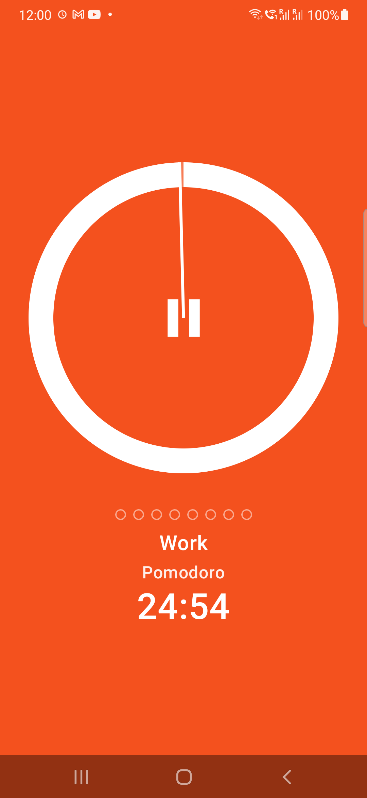
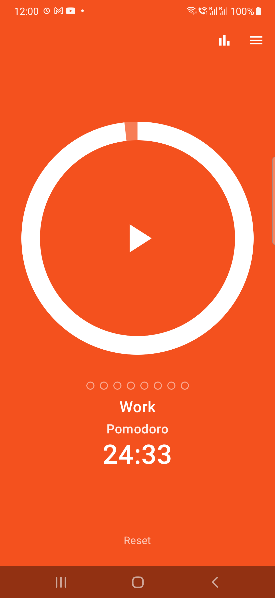
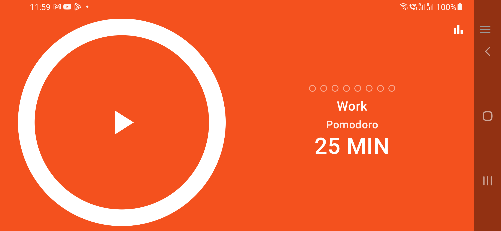
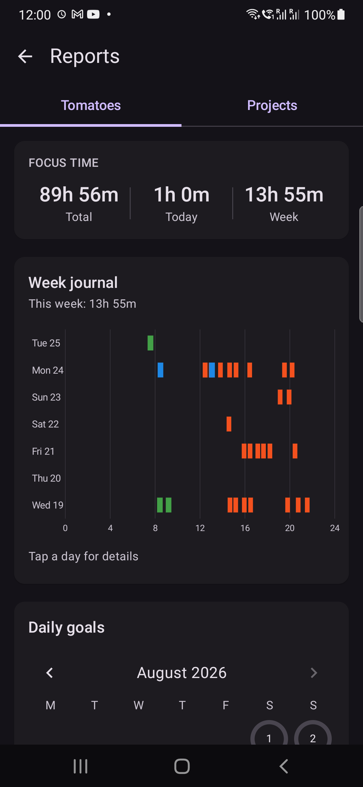
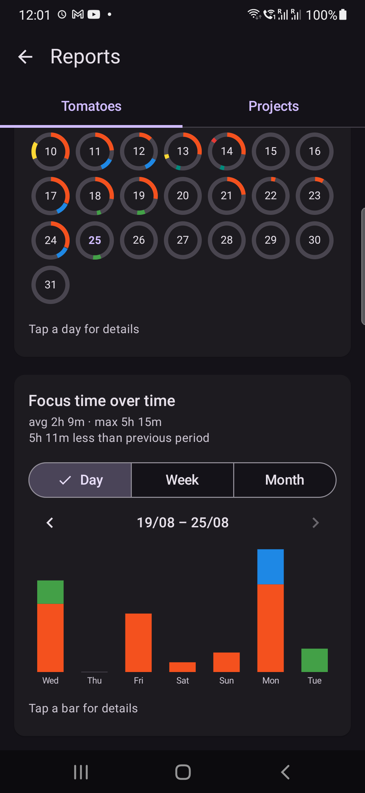
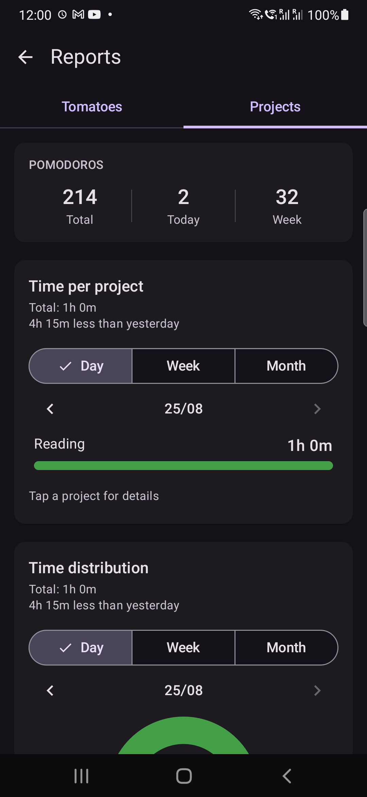
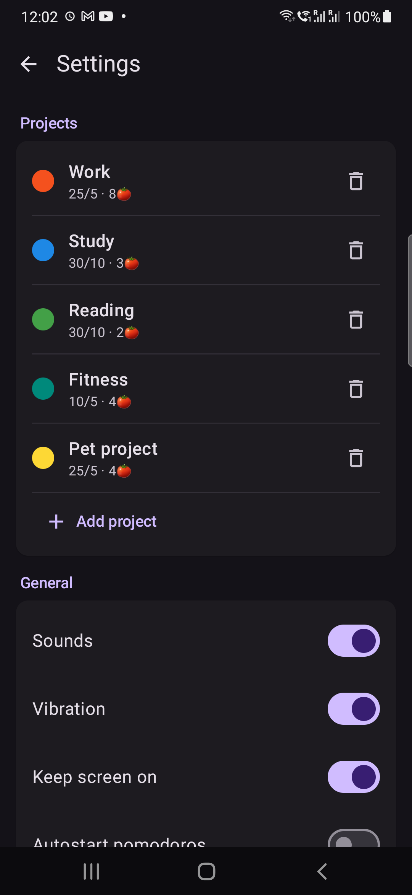
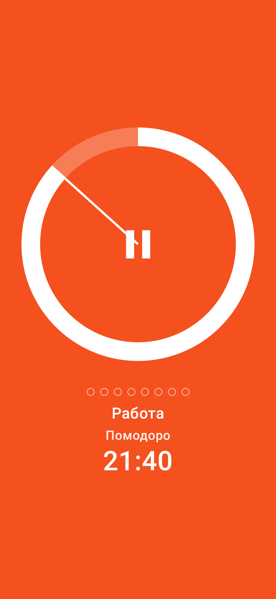

# Pomodoro Tracker

[](https://github.com/Dr-klo/pomodoro-tracker/actions/workflows/ci.yml)
[](LICENSE)

Native Android Pomodoro timer with per-project presets, a classic circular dial, and a full
statistics module. Built in Kotlin + Jetpack Compose. Offline, no accounts, no monetization.

**[⬇ Download the APK](https://github.com/Dr-klo/pomodoro-tracker/releases/latest)** — Android 10+, ~3 MB, no dependencies.

> Installing takes one extra tap: the build is signed with a personal key rather than distributed
> through Google Play, so Android will warn about an unknown source and Play Protect may ask again.
> Each release page publishes the APK's SHA-256 if you want to check what you downloaded.

See [PRD.md](PRD.md) for the full product spec.

## Screenshots

| Running | Paused | Landscape |
|---|---|---|
|  |  |  |

| Focus time & week journal | Month goals & trend | Per-project breakdown |
|---|---|---|
|  |  |  |

| Settings & presets | Russian locale |
|---|---|
|  |  |

## Features

- **Circular dial** that empties as the countdown runs, with a clock hand and tap-to-pause /
  hold-to-reset gestures.
- **Projects** (Work, Study, Reading, …) — each with its own focus/break durations, pomodoro
  count, colors, daily goal, and long break. Swipe to switch (only while stopped/paused).
- **Single global timer** kept alive by a foreground service; controllable from the notification.
- **Phase color fills the background**, white foreground; manual phase switching (pomodoro /
  break / long break) by tapping the phase label.
- **Idle alert**: a gentle screen-color strobe every N minutes when a pomodoro/pause is left idle.
- **Always-on display**, **autostart** (pomodoros and breaks separately), **vibration**, crisp
  synthesized **sounds**, **daily goal** with a fanfare, configurable **end-of-day** time.
- **Reports** — two tabs (Tomatoes / Projects): week journal, monthly goals calendar with donut
  rings, focus-time & pomodoro-count stacked bars, per-project bars, and a distribution donut.
  Day/Week/Month aggregation, period navigation, and "vs previous period" comparisons.
- **EN / RU** localization and **System / Light / Dark** theme.

## Tech stack

- **Language:** Kotlin 2.3, `minSdk 29` (Android 10), `target/compileSdk 37`
- **UI:** Jetpack Compose (Material 3), custom `Canvas` charts and dial
- **Persistence:** Room (`pomodoro.db`) for projects, daily counts, and the pomodoro log;
  DataStore Preferences for settings
- **Async:** Kotlin Coroutines + Flow / StateFlow
- **DI:** manual service locator (`AppContainer`) held by the `Application`
- **Build:** Gradle 9 (KTS) with a version catalog (`gradle/libs.versions.toml`), AGP 9.3, KSP

## Project structure

```
app/src/main/java/com/drklo/pomodoro/
├─ PomodoroApp.kt          Application: owns AppContainer, seeds default projects
├─ MainActivity.kt         setContent + NavHost + theme/locale wiring
├─ data/
│  ├─ AppContainer.kt      DB, repositories, and the single TimerEngine
│  ├─ LogicalDay.kt        end-of-day boundary → logical date/day key
│  ├─ model/               Project, Phase, TimerStatus, GlobalSettings, PomodoroLog, enums
│  ├─ db/                  Room entities, DAOs, AppDatabase (+ migration), mappers
│  └─ repository/          Project / Stats / Settings repositories
├─ timer/
│  ├─ TimerEngine.kt       single source of truth: state machine, ticking, idle alert
│  ├─ TimerService.kt      foreground notification + controls
│  ├─ TimerEffects.kt      sound (synthesized) + vibration
│  └─ ToneSynth.kt         runtime WAV "ding" generator
├─ ui/
│  ├─ main/                MainScreen + dial / bullets / fanfare components, MainViewModel
│  ├─ reports/             ReportsScreen, aggregation logic, chart components
│  ├─ settings/            Settings + project editor screens and view models
│  ├─ common/Stepper.kt
│  └─ theme/
└─ util/                   LocaleHelper, BatteryOptimization, context helpers
```

### Architecture

`TimerEngine` is a singleton in `AppContainer` and the single source of truth for the one global
timer. It exposes `StateFlow<TimerState>` + a `SharedFlow<TimerEvent>`; the UI (`MainViewModel` /
Compose) and `TimerService` only observe it and forward user actions. Ticking is drift-free
(computed from `SystemClock.elapsedRealtime` deadlines). Completed pomodoros persist the daily
counter and a detailed log row used by the reports.

```
[MainScreen / ViewModels] ─┐                      ┌─ [Room: projects, day_stats, pomodoro_log]
                           ├─→ [TimerEngine] ──────┤
[TimerService (foreground)]┘   (single timer)      └─ [DataStore: settings]
```

## Build & run

Requires Android 10+ (`minSdk 29`), portrait and landscape. Developed and manually verified on a
Samsung Galaxy A50 / A51 running One UI.

Android Studio is the simplest path: open the project, let the first Gradle sync run, and launch
the `app` configuration. From the command line (use `gradlew.bat` on Windows):

```bash
./gradlew :app:assembleDebug     # -> app/build/outputs/apk/debug/app-debug.apk
./gradlew :app:check             # unit tests, Android Lint, detekt (production + test sources)
./gradlew :app:connectedAndroidTest   # Room migration + repository, needs a device or emulator
adb install -r app/build/outputs/apk/debug/app-debug.apk
```

The Android SDK location comes from `local.properties`, which is not in version control; Android
Studio writes it on first sync.

> `connectedAndroidTest` uninstalls the app before it runs, and Android deletes the database with
> it. Point it at an emulator, or back up first — this has cost real data twice.

The Compose tests are deliberately *not* instrumented: they assert the semantics tree, which
Compose builds without a renderer, so Robolectric runs them on the JVM in seconds and CI needs no
emulator. The instrumented set is reserved for what genuinely needs Android — SQLite migrations and
the repository against a real database.

### Release builds

Signing is configured only when a `keystore.properties` is found — first in `~/.pomodoro/`, then in
the project root. The keystore and its passwords deliberately live **outside** the repository: a
signing key leaked into a public history has no revocation path, and `.gitignore` alone is a single
layer of defence.

```properties
# ~/.pomodoro/keystore.properties  — forward slashes: '\' escapes in .properties files
storeFile=/absolute/path/to/release.jks
storePassword=…
keyAlias=…
keyPassword=…
```

Without that file the app still builds; the release variant simply comes out unsigned.
`./gradlew :app:assembleRelease` produces a ~2.9 MB APK (R8 and resource shrinking are on).

### Samsung background note

One UI can put apps into deep sleep and kill long-running timers. In-app: **Settings → Background
reliability → Disable battery optimization**. If timers still die, remove the app from
**Device care → Battery → Sleeping apps**.

## Engineering process

The codebase went through a full review, run as a documented protocol rather than a read-through.
The working documents are in Russian — [docs/CODE_REVIEW_PLAN.md](docs/CODE_REVIEW_PLAN.md) is how
to review, [docs/REVIEW_FINDINGS.md](docs/REVIEW_FINDINGS.md) is what was found — so what they
contain is summarised here.

**The protocol.** One stage per session, seven stages by area (linters, `timer/`, `data/`,
`ui/reports/`, `ui/main/`, `ui/settings/`, cross-cutting). Review only the paths in scope; anything
noticed outside them gets one line in a "seen out of scope" list and no investigation. Findings are
never fixed while reviewing — fixes are a separate pass, so a review does not turn into a blind
refactor. Every finding carries a cross-cutting ID, a severity, a `file:line`, and a **concrete
failure scenario**: which inputs produce which wrong behaviour. The rule that keeps the list honest:

> Without a scenario it is not a finding, it is an opinion.

**What it produced.** 63 findings — 3 × P1, 24 × P2, 36 × P3 — and five themes larger than any
single item. The sharpest: "how many pomodoros today" had three different answers, from the engine's
in-memory counter, the `day_stats` table, and the `pomodoro_log` rows.

The three P1s are a fair sample of what the protocol catches:

| ID | Failure |
|---|---|
| `F-R1-01` | The day counter did not cross the logical-day boundary, so after midnight the daily goal could never fire again |
| `F-R5-01` | Deleting the active project left the timer pointing at something gone: no carousel page matched it, and play, reset and swipe all stopped responding |
| `F-R0-01` | The dial — tap to pause, drag to seek — was invisible to screen readers: raw pointer input over a Canvas announces no name, role or state. Fixed; the label written for it during the review had been sitting unattached ever since |

**Decisions were recorded, including the refusals.** Four findings are `wontfix` and two `deferred`,
each with its reasoning beside it. One product decision — that a deleted project's history must stay
visible in reports — turned "clean up orphaned rows" into "implement soft delete", and the cascade
delete that looked obvious on first reading became exactly the wrong fix.

**Fixes shipped as ten packages, W0–W10, one commit each**, in a deliberate order: unblock the
linters, then build something to verify with (a time seam, ports instead of concrete classes,
exported Room schemas), then close the data-integrity theme in one pass, then threading.

## Design decisions

**Manual dependency injection.** `AppContainer` is a service locator held by the `Application`, not
Hilt or Koin. At roughly 6 000 lines in a single module with one entry point, the whole dependency
graph fits on one screen and reads top to bottom; a compiler plugin and a generated graph would add
moving parts without removing any.

What makes that work is not the container but the seams around it. `TimerEngine` depends on
`SettingsSource`, `PomodoroStats`, `PhaseFeedback` and `TimeSource` — interfaces, not the classes
implementing them — so tests substitute fakes and drive a virtual clock without a framework and
without touching Android. The container exists to assemble those, and for nothing else.

This stops being the right answer at a second module, a second entry point, or the first dependency
that needs a scope narrower than "one instance per process". None of those is true yet.

**One timer, owned by the engine.** `TimerEngine` is the single source of truth; the UI and the
foreground service observe a `StateFlow` and forward user actions. Nothing else holds elapsed time,
so the notification and the screen cannot disagree about it. Ticking is computed from a monotonic
deadline rather than accumulated, so it does not drift.

## Limitations

Stated plainly, because a reader will find them anyway:

- **Accessibility is started, not finished.** The main screen is covered — the dial announces its
  phase, state and remaining time and can be activated by a screen reader (`F-R0-01`, closed) — but
  Reports and Settings have had no equivalent pass, and the charts are Canvas drawings with nothing
  behind them for a screen reader to read.
- **UI tests cover components, not screens.** 86 tests run on the JVM: the timer engine,
  aggregation, formatting and locale rules, plus ten Compose tests that pin the semantics of the
  dial, the stepper and the segmented choice under Robolectric. Two instrumented tests cover Room
  migration and project archiving on a real device. No test drives a whole screen or a user journey
  end to end; those are verified by hand.
- **One device family.** Developed and checked on a Samsung Galaxy A5x running Android 11.
  `targetSdk` is current, but the runtime behaviour changes that come with it are untested on newer
  Android versions.
- **Sideload only.** Signed with a personal key rather than distributed through Google Play, and the
  foreground service uses the `specialUse` type, which a store submission would have to argue for.
- **72 accepted findings in the detekt baseline**, mostly unnamed constants in chart geometry and
  audio synthesis. Formatting is fixed rather than recorded; what is left is real, if minor, debt.
- **Statistics start at install.** Detailed history accrues from pomodoros completed afterwards;
  earlier daily counts are not backfilled into the timeline.
- **The in-progress interval does not survive process death** — on purpose. The completed count for
  the day is restored; a half-finished pomodoro is not.
